## Page

* Page：UI表现差别较大，多个UI下的节点信息有差别，就可以是一个新Page

## 怎么区分Page和Theme

* 只要多套UI的节点信息不一致，不能通过简单（10行）的代码实现，就是Page
* 更换背景、图片、字体颜色等不改变节点组织形式的，都是Theme

> 两个样子只有按钮颜色发生变化，基本结构一致，就是Theme

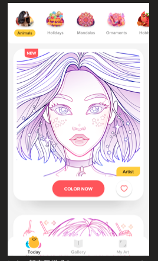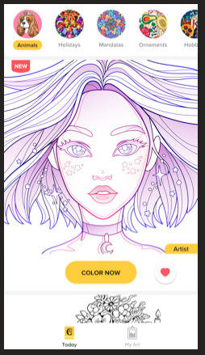

> 看似差不多，其实添加了分类，对页面整体布局变化比较大，使用Page

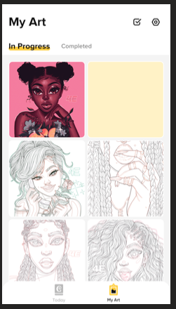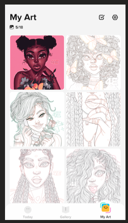

>  底部三个按钮变两个差距比较大，使用Page

## Page例子

#### Prefab

######  Prefab

* 命名：{PageName}, 例如 TodayPage1, TodayVerticalPage
* 路径：Prefab/uGUI/{功能}{PageName目录}   或者 {功能}{PageName}， 
  * ① today/page1/page1.prefab : 此page下有子prefab，将子Prefab全部放入page1目录下
  * ② today/page1.prefab : 此page下就这一个prefab，不需要写一个文件夹
* Common文件夹：Prefab/uGUI/{功能}/Common  此目录下放公用的Prefab，例如用于处理打点的基类

###### 避免Prefab相似元素重复开发

* 整理构建更小可通用小组件

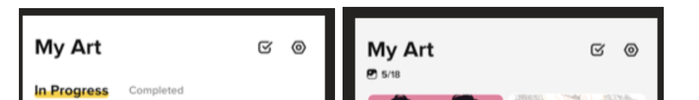

​			以MyArt的头部为例，头部逻辑/展示相同，抽离出MyArtTop，两个Page复用Top

* 不同Page下按钮个数位置/个数不同，尽量只体现在Prefab中，避免代码改动

  

  

  首页底部两个UI下的位置、个数和点击后的帧动画不一样，但是点击事件都相同。

  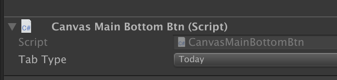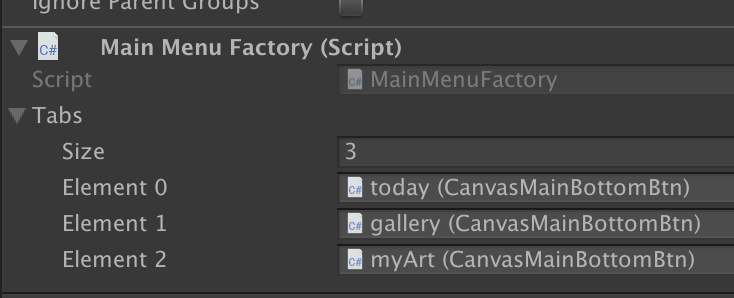

  

  * 脚本上设置好点击类型，通过类型处理点击事件切换页面。

  * tab个数通也通过拖拽在Prefab中确定

#### Component

###### 规范

* 命名：{功能}{PageName},  例如 TodayPage1.cs / TodayVerticalPage.cs
* 文件路径 : 0_Code/UI/{功能}{Page目录}{page}  或者 {功能}{page}， 同Prefab一致
* Common： 同Prefab一致

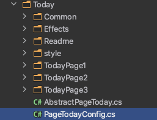

###### 创建Page的基类：同一个Page下的统计、业务逻辑一致，Copy两份代码不可取

#### 资源

###### 规范

* 命名：同Prefab命名一致
* 路径： 
  * 不同产品路径： Assets/Resource/Chopin01/Image/{功能}/{Page}/ x.png
  * 不同产品公用文件： Assets/Resource/Common/Image/{功能}/{Page}/ x.png

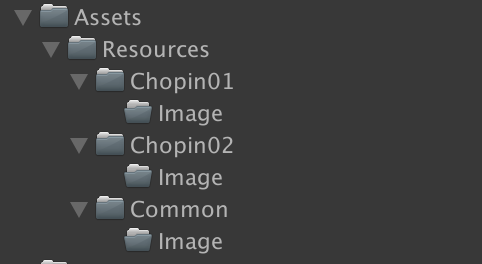

###### Common资源

为什么要设置Common： 设置Common之后，资源不用加两遍，既提高了效率，又减少忘记放图犯错的可能（比如一些开关，可能没有测到就上线了）

哪些属于Common资源

* 通过color修改的图，一般是一些九宫格图，通用按钮等
* 同一个Page需要在两个产品上线

###### 资源加载

* 只有Common下的资源才允许直接拖拽到Prefab上
* 不在Common下的资源，先使用Resource.load方法，后期将会扩展Image组件，以支持友好的拖拽 @TODO

#### 数据层设计

###### 多个Page适配一套Data：每个Page创建自己的Adapter

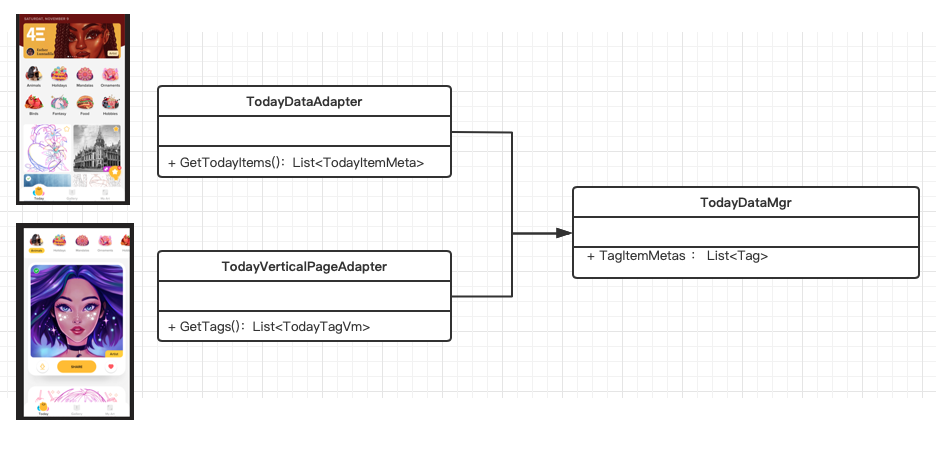

###### 一个Page通过A/B确定不同数据来源：在数据源中处理

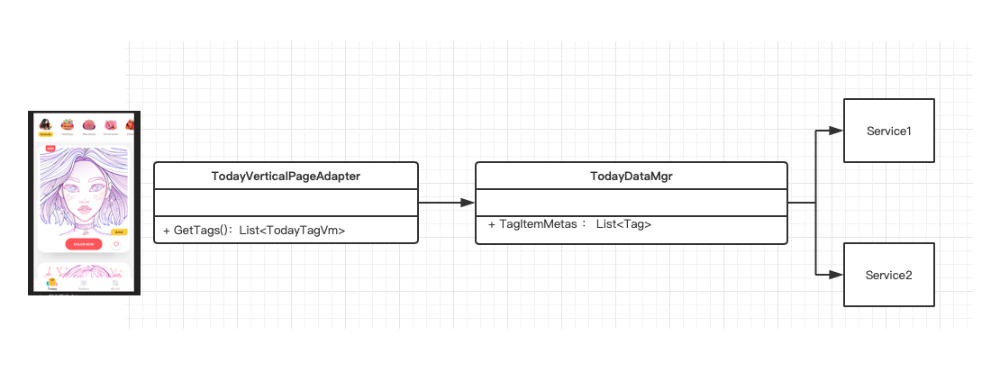

A/B 在数据源出做处理，Page对数据源无感知

#### 多Page父类和接口设计

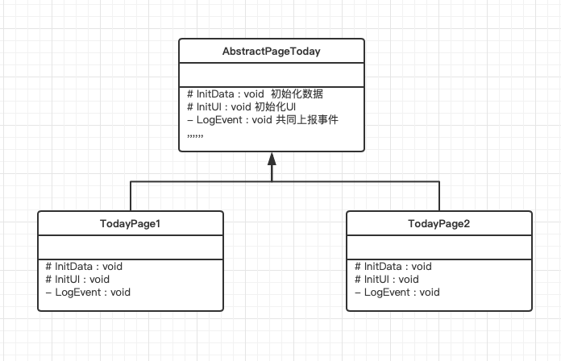

为什么要建立基类？

* 定义Page后，两个Page的有相同功能、事件上报等，不用重复开发

* 两个Page copy公共代码会让公共代码的执行顺序、代码量上有差异，后期维护困难

* 建立基类后，新建页面有了规则，知道必须要实现哪些接口

  